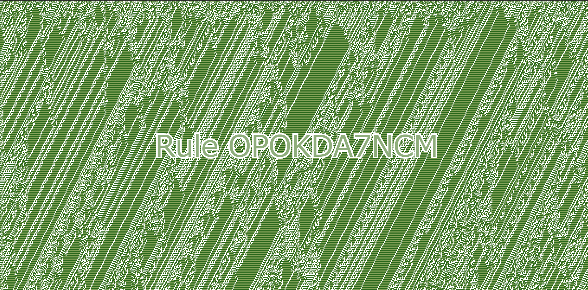
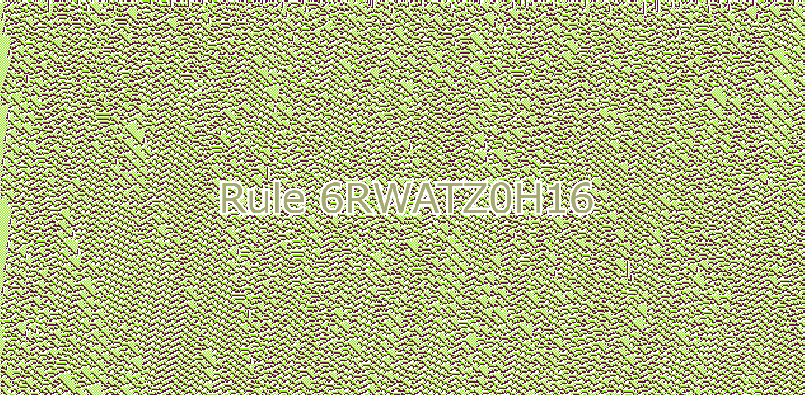
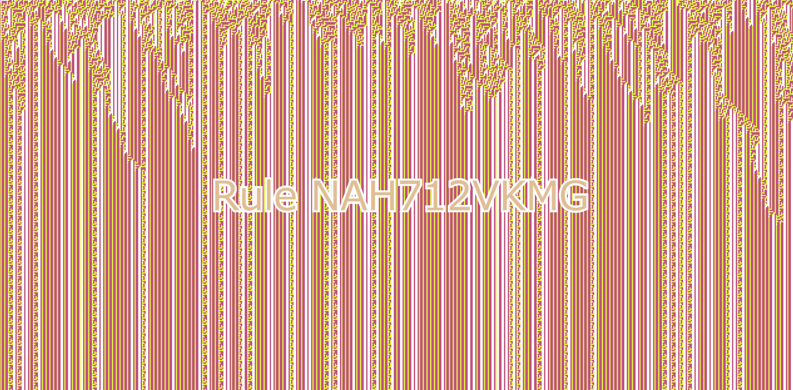
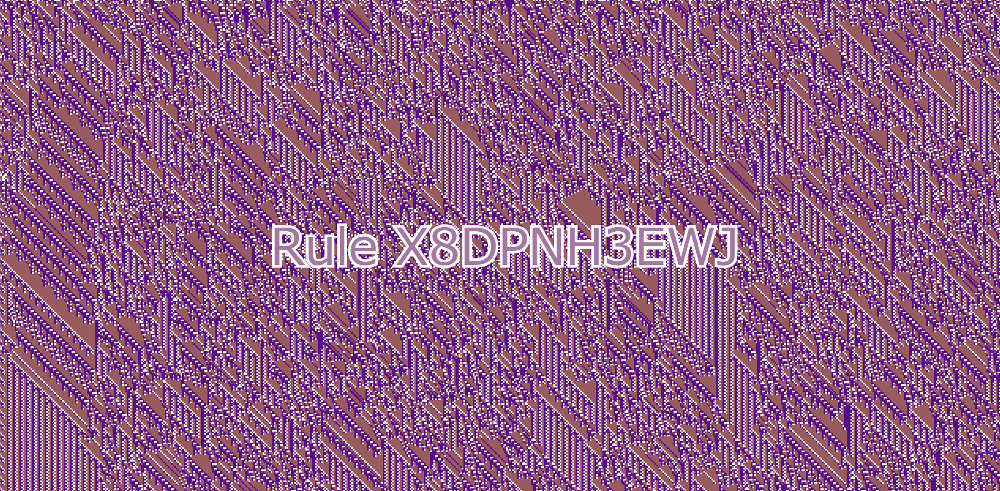
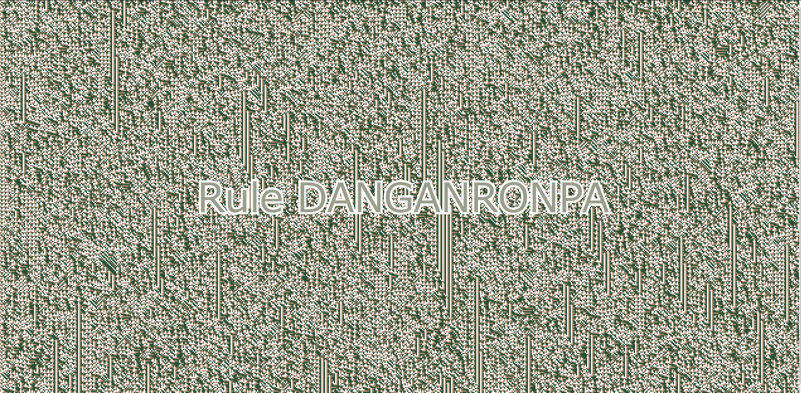

# CELL ARTMATON

１次元３状態３近傍のセルオートマトン

初期のセル状態配列を**ランダムに決定**
セルが各状態で示す色は白を除き**ランダムに設定される**

各状態遷移はセルの状態を０〜２の数値とした時、自信を含む近傍のセルの状態数値を文字列として繋げ合わせて数値化し、**最大のものから並べる**
整列した状態遷移規則が示す次世代の状態数値を全て繋げて**36進数**として解釈した文字列が状態遷移規則名として画面に表示される

## サンプル

1~4はランダム文字列で生成、5, 6は指定した文字列で生成

